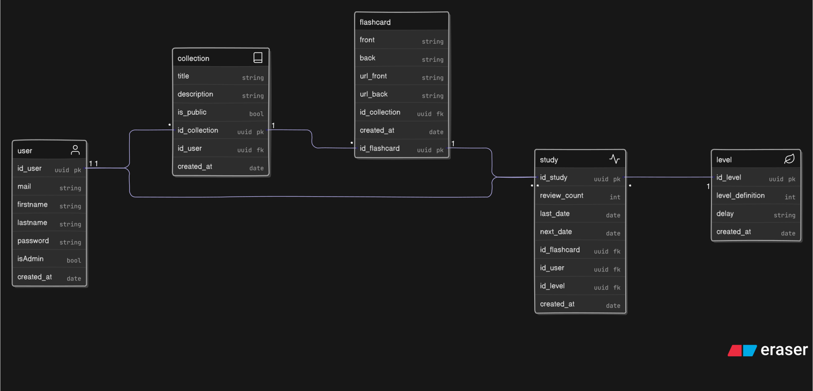

# Documentation

## Schéma de la base de données

## Documentation de l'API - Flashcard App

Cette partie de la documentation détaille les endpoints de l'API, les méthodes associées, et les niveaux d'accès requis.

---

### 🔐 Authentification (`/auth`)

Gestion de la création de compte et de la connexion.

| Méthode  | Chemin      | Rôle fonctionnel            | Authentification | Champs d'entrée                                                                                                                  |
| :------- | :---------- | :-------------------------- | :--------------- | :------------------------------------------------------------------------------------------------------------------------------- |
| **POST** | `/register` | Créer un nouvel utilisateur | Publique         | **Body**: `mail` (email), `firstName` (string, 2-30), `lastName` (string, 2-30), `password` (string, min 8), `isAdmin` (boolean) |
| **POST** | `/login`    | Authentifier l'utilisateur  | Publique         | **Body**: `mail` (email), `password` (string, min 8)                                                                             |

---

### 👤 Utilisateur (`/whoami`)

Informations sur la session courante.

| Méthode | Chemin | Rôle fonctionnel                                | Authentification | Champs d'entrée |
| :------ | :----- | :---------------------------------------------- | :--------------- | :-------------- |
| **GET** | `/`    | Récupérer les données de l'utilisateur connecté | Authentifié      | Aucun           |

---

### 📁 Collections (`/collections`)

Gestion des groupes de flashcards.

| Méthode    | Chemin           | Rôle fonctionnel                        | Authentification                            | Champs d'entrée                                                                        |
| :--------- | :--------------- | :-------------------------------------- | :------------------------------------------ | :------------------------------------------------------------------------------------- |
| **GET**    | `/mine`          | Lister les collections de l'utilisateur | Authentifié                                 | Aucun                                                                                  |
| **GET**    | `/:id`           | Détails d'une collection via son ID     | Authentifié (Public, Propriétaire ou Admin) | **Route param**: `id`                                                                  |
| **GET**    | `/title/:title`  | Chercher une collection par son titre   | Authentifié                                 | **Route param**: `title`                                                               |
| **POST**   | `/`              | Créer une nouvelle collection           | Authentifié                                 | **Body**: `title` (string, 1-255), `description` (string, 1-255), `isPublic` (boolean) |
| **PUT**    | `/:idCollection` | Modifier une collection                 | Authentifié (Propriétaire)                  | **Route param**: `idCollection` **Body**: `title`, `description`, `isPublic`        |
| **DELETE** | `/:idCollection` | Supprimer une collection                | Authentifié (Propriétaire)                  | **Route param**: `idCollection`                                                        |

---

### 📇 Flashcards (`/flashcards`)

Gestion des cartes individuelles et des révisions.

| Méthode    | Chemin                   | Rôle fonctionnel                        | Authentification                            | Champs d'entrée                                                                                                             |
| :--------- | :----------------------- | :-------------------------------------- | :------------------------------------------ | :-------------------------------------------------------------------------------------------------------------------------- |
| **GET**    | `/:id`                   | Détails d'une flashcard spécifique      | Authentifié (Public, Propriétaire ou Admin) | **Route param**: `id`                                                                                                       |
| **GET**    | `/collection/:id`        | Voir toutes les cartes d'une collection | Authentifié (Public, Propriétaire ou Admin) | **Route param**: `id` (de la collection)                                                                                    |
| **GET**    | `/collection/:id/review` | Voir les cartes à réviser               | Authentifié (Propriétaire ou Admin)         | **Route param**: `id` (de la collection)                                                                                    |
| **POST**   | `/`                      | Créer une nouvelle flashcard            | Authentifié (Propriétaire de la collection) | **Body**: `front` (string, min 1), `back` (string, min 1), `urlFront` (string), `urlBack` (string), `collectionId` (string) |
| **POST**   | `/edit/:id`              | Modifier une flashcard                  | Authentifié (Propriétaire)                  | **Route param**: `id` **Body**: `front` (string), `back` (string), `urlFront` (string), `urlBack` (string)               |
| **PATCH**  | `/:id/review`            | Noter une révision (algorithme)         | Authentifié                                 | **Route param**: `id`                                                                                                       |
| **DELETE** | `/:id`                   | Supprimer une flashcard                 | Authentifié (Propriétaire)                  | **Route param**: `id`                                                                                                       |
